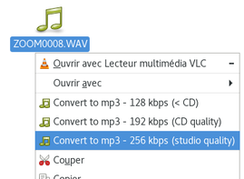
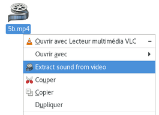
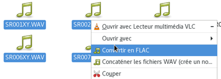

# Some [more or less custom] Nemo actions

## Audio / Video

    

  * **extract_sound** : use **ffmpeg** to extract sound from video, and create a sound file in the same dir (with corresponding extension)
  * **concatenate_wavs** : use **sox** to concatenate multiple wavs, and create a resulting wav file in the same dir (named as concatenation of wavs filenames)
  * **convert_to_mp3** : use **lame** to convert file to mp3, and create a sound file in the same dir (with corresponding extension). No check is done on the file format (must be wav)
  * **convert_to_flac** : use **flac** to convert files to flac, and create sound files in the same dir (with corresponding extension). No check is done on the file format (must be wav)
  * **image_resize** : use **mogrify** to resize images
  * **stabilize_videos** : use **ffmpeg / libvid.stab** to stabilize a video file, or all videos inside a directory, and display advancement using **zenity**

## Others

  * **paste_link** : create a softlink to selected file, in the same directory (same name, prefixed by "link to")
  * **pdfimages_extract** : use **pdfimages** command (`poppler-utils` package in Debian) to extract images from PDF and place them in "pdfimages" subdir
  * **pdf_repair** : use **qpdf** command to repair PDF file and create "-repaired.pdf" file
  * **pdf_to_djvu** : use **pdf2djvu** command to convert PDF file to DJVU format

## INSTALL

  - link or put files to `~/.local/share/nemo/actions/`
  - restart nemo (`nemo -q`)

## TODO

  * catch errors and use Zenity to pass error messages to user
