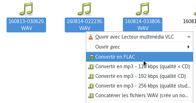
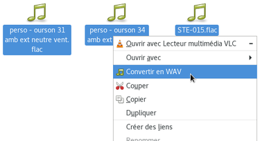
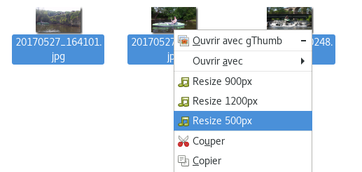
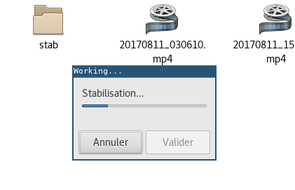

# Some [more or less custom] Nemo actions

**Update** since some versions of nemo, some actions doesn't works anymore. This is due to [an issue](https://github.com/linuxmint/nemo/issues/2274) in nemo actions files parsing (this is a problem parsing `%` of bash parameter expansion).
The problem has been fixed in [this commit](https://github.com/linuxmint/nemo/commit/5802d296191b4ccb7f14baa5889a9fa44d0d0f75) and deployed in Nemo version **4.8.3**. If you use an older version of Nemo you should see some errors invoking `%F`. Try to update Nemo to a version >= 4.8.3

## Audio / Video

   

  * **extract_sound** : use **ffmpeg** to extract sound from video, and create a sound file in the same dir (with corresponding extension)
  * **concatenate_wavs** : use **sox** to concatenate multiple wavs, and create a resulting wav file in the same dir (named as concatenation of wavs filenames)
  * **convert_to_mp3** : use **lame** to convert files to mp3, and create sound files in the same dir (with corresponding extension). No check is done on the file format (must be wav)
  * **convert_to_wav** : use **ffmpeg** to convert files to wav, and create sound files in the same dir (with corresponding extension).
  * **convert_to_aac** : use **ffmpeg** to convert files to aac, and create sound files in the same dir (with corresponding extension).
  * **convert_to_flac** : use **flac** to convert files to flac, and create sound files in the same dir (with corresponding extension). No check is done on the file format (must be wav)
  * **normalize audio** : use **ffmpeg** to normalize audio levels (using `loudnorm` filter), and create sound files in the same dir (with "-norm" appended to name). No check is done on the file format (must be wav)
  * **flac_to_wav** : use **flac** to extract selected flac file(s) to wav
  * **image_resize** : use **mogrify** (ImageMagick) to resize images
  * **stabilize_videos** : use **ffmpeg / libvid.stab** to stabilize a video file, or all videos inside a directory, and display advancement using **zenity**
  * **convert_to_gif**: use **ffmpeg** to convert selected videos to Gif (animated)

## Others actions

  * **paste_link** : create a softlink to selected file, in the same directory (same name, prefixed by "link to")
  * **pdfimages_extract** : use **pdfimages** command (`poppler-utils` package in Debian) to extract images from PDF and place them in "pdfimages" subdir
  * **pdf_repair** : use **qpdf** command to repair PDF file and create "-repaired.pdf" file
  * **pdf_to_djvu** : use **pdf2djvu** command to convert PDF file to DJVU format
  * **link to Public** : make a link to the file onto ~/Public directory (typically shared via Samba)
  * **remove_empty_dirs** : recursively remove dirs that do not contains any file
  * **remove_node_modules** : recursively remove `node_modules` dirs
  * **remove_exif_data** : use **exiftool** to remove exif data from image
  * **remove_empty_dirs** : recursively remove dirs that do not contains any file
  * **mass_rename** : launch [Thunar's mass reame utility](https://docs.xfce.org/xfce/thunar/bulk-renamer/start) with selected files

## Install

  - install zenity
  - install lame (to use audio conversion scripts)
  - `bundle install` (this will install Ruby dependencies)
  - link or put files to `~/.local/share/nemo/actions/`
  - restart nemo (`nemo -q; nemo`)

### Other dependencies

  - Imagemagick (`apt install imagemagick`) to use images resizing
  - ffmpeg (`apt install ffmpeg`) to use video tools
  - sox (`apt install sox`) to use wavs concatenation tools
  - lame (`apt install lame`) to use audio conversions tools
  - flac (`apt install flac`) to use flac compression tools
  - pdfimages (`apt install poppler-utils`) to use PDF images extraction tools
  - pdf_repair (`apt install qpdf`) to use PDF file repairing tools
  - pdf2djvu (`apt install pdf2djvu`) to use PDF to DJVU conversion tool
  - Thunar (`apt install thunar`) to use mass rename action

All in one:

    apt install imagemagick ffmpeg sox lame flac pdfimages pdf_repair pdf2djvu thunar

## Debug

`nemo -q; NEMO_DEBUG=Actions nemo`

## Write an action

To make scripts executed to multiple files with a progress bar, use `bash_action.rb`. Simple example:
  - execute `ls` command on each selected files:
    `Exec=<scripts/bash_action.rb "ls {}" %F>`
  - same effect, but adding a bash variable:
    `Exec=<scripts/bash_action.rb "filename={}; ls \"$filename\"" %F>`

Take a look to existing actions. Particularly `flac_to_wav.nemo_action` is a simple real-world example.

To specify icon you can use `Icon-Name`. Available icons are located in `/usr/share/icons/gnome/32x32/actions`.

## Debug actions (show actions logs and Nemo errors about actions)

```
nemo -q; NEMO_ACTION_VERBOSE=1 nemo --no-desktop
```

### Some tricks:
- the space between `"` and `%F>` is important; ie `"%F>` will **not** work

## TODO

  * catch errors and use Zenity to pass error messages to user
